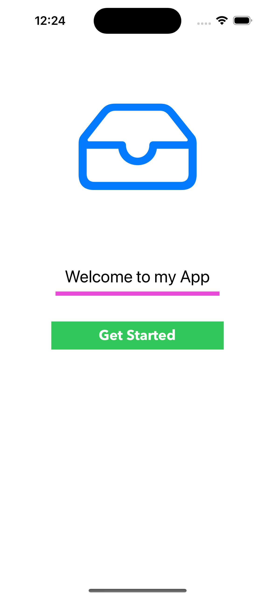
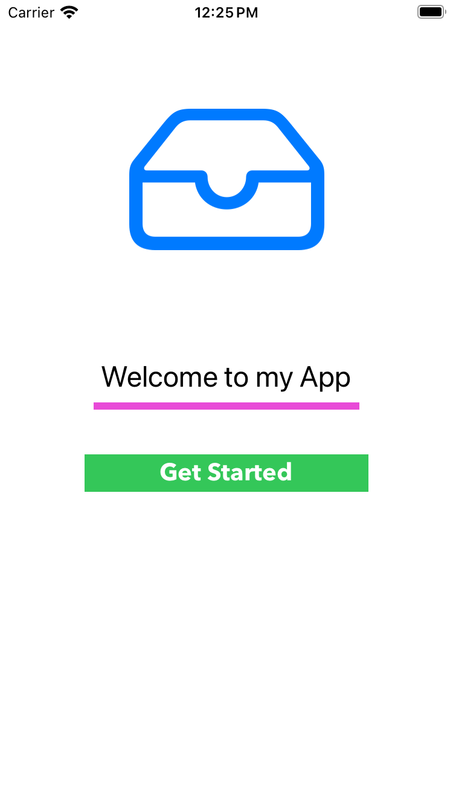
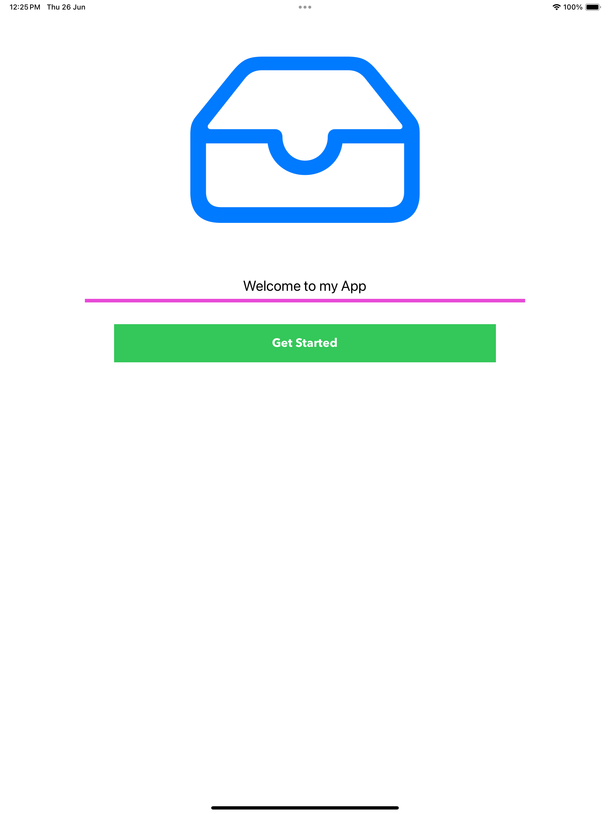

# Auto Layout – Storyboard Challenge 2

## 🧠 What I Learned

In this challenge, I focused on understanding how to **accurately position UI elements** using Auto Layout in Storyboard. I learned:

- How an element takes its correct layout through:
  - **X** (horizontal position)
  - **Y** (vertical position)
  - **Width** (how wide it is)
  - **Height** (how tall it is)
- The difference between **Center X** and **Center Y**, and how to use them for centering elements properly.
- How to make the layout flexible and responsive to different screen sizes.

## 🎯 My Goal

Build a layout that **adapts correctly on all screen sizes**, ensuring a smooth and consistent user experience across devices.

## 🛠️ Tools Used

- Xcode Storyboard
- Auto Layout constraints

## 📱 Screenshots

### iPhone 11

### iPhone SE

### iPad 13-inch

## ✅ Result

A clean, responsive layout that works properly on all screen sizes.  
This challenge helped me understand how to build **device-independent UI** using constraints the right way.
